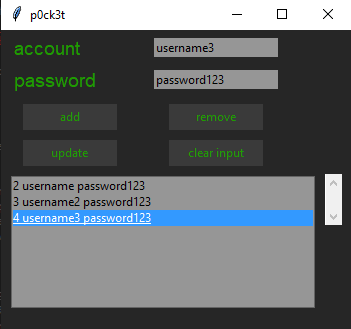

# p0ck3t


> this application allows you to store your passwords securely \
> it was created to store your daily usage passwords



### Usage

#### ***Install dependencies***
```bash
pipenv install
```

#### ***Run script***
```bash
python w4ll3t.py
```

> compiled with pyinstaller

#### ***Windows***
```bash
pyinstaller --onefile --windowed w4ll3t.py
```

#### ***MacOS***
```bash
pyinstaller --onefile --add-binary='/System/Library/Frameworks/Tk.framework/Tk':'tk' --add-binary='/System/Library/Frameworks/Tcl.framework/Tcl':'tcl' w4ll3t.py
```


### License:
Copyright © Kemal Demirgil. All rights reserved.
Licensed under the [MIT](https://github.com/kemaldemirgil/p0ck3t/blob/main/LICENSE) license.


